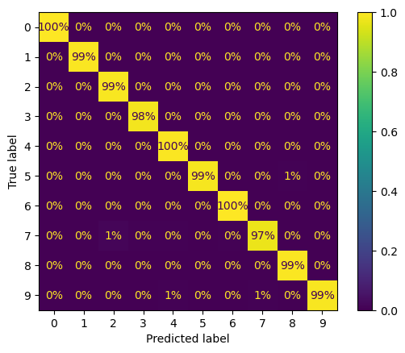

# 🚀 Image Classification Model: Transfer Learning with Xception

## 🔍 Overview
Multi-class image classification is a fundamental problem in computer vision, and transfer learning enables powerful, accurate solutions with minimal training time. This project leverages a **pretrained Xception model** (on ImageNet) for classifying images into **10 categories**, using a **two-phase training strategy** to achieve **98.96% test accuracy** with **precision of 99.97%** and **recall of 100%**.

### 📌 Key Features:
- ✅ **Transfer Learning**: Uses **Xception** pretrained on **ImageNet**  
- ✅ **Two-Phase Training**: Train only the top layers first, then fine-tune deeper layers  
- ✅ **Efficient Optimization**: SGD optimizer with learning rate scheduling  
- ✅ **High Generalization**: Achieves near-perfect classification performance  
- ✅ **Visual Evaluation**: Includes detailed confusion matrix for class-wise insights  

---

## 📊 Performance Metrics

| Training Phase | Accuracy (Validation) | Accuracy (Test) | Precision | Recall |
|----------------|------------------------|------------------|-----------|--------|
| **Phase 1** (Frozen base) | ~94% | — | — | — |
| **Phase 2** (Fine-tuned) | ~96.3% | **98.96%** | **99.97%** | **100.00%** |

📈 **Fine-tuning the pretrained model improves classification performance dramatically!**

---

## 🔧 Technology Stack
- **Python** 🐍  
- **Deep Learning Framework**: TensorFlow / Keras  
- **Pretrained Model**: Xception (via `tf.keras.applications`)  
- **Data Loading**: `image_dataset_from_directory`  
- **Visualization**: Matplotlib  

---

## 🛠 How It Works

### 1️⃣ Data Preparation
- Directory structure:
```bash
dataset/
├── train/
│   ├── class1/
│   ├── class2/
│   └── ...
└── test/
    ├── class1/
    ├── class2/
    └── ...

```

- Loaded using:
```python
tf.keras.utils.image_dataset_from_directory(
    path, image_size=(256, 256), label_mode="categorical"
)
```

### 2️⃣ Model Architecture (Transfer Learning)
```python
base_model = tf.keras.applications.Xception(weights="imagenet", include_top=False)
avg = tf.keras.layers.GlobalAveragePooling2D()(base_model.output)
output = tf.keras.layers.Dense(10, activation="softmax")(avg)
model = tf.keras.Model(inputs=base_model.input, outputs=output)
```
---
### 3️⃣ Training Strategy
✅ Phase 1: Train Top Layers Only

```python
for layer in base_model.layers:
    layer.trainable = False

model.compile(optimizer=tf.keras.optimizers.SGD(learning_rate=0.1, momentum=0.9),
              loss='categorical_crossentropy',
              metrics=['accuracy'])

model.fit(train_data, validation_data=val_data, epochs=3)
```
🔁 Phase 2: Fine-Tune Top Layers of Base Model
```python
for layer in base_model.layers[56:]:
    layer.trainable = True

model.compile(optimizer=tf.keras.optimizers.SGD(learning_rate=0.01, momentum=0.9),
              loss='categorical_crossentropy',
              metrics=['accuracy'])

model.fit(train_data, validation_data=val_data, epochs=10)
```
---

### 📉 Confusion Matrix (Test Set)
<p align="center">  </p>

- 🔥 Nearly perfect predictions across all classes

- 🔁 Minor confusion in only a few examples

- ✅ Strong diagonal confirms consistent precision & recall across all categories

---

### 🏆 Why This Project Stands Out
- Real-world deep learning with pretrained models

- Fine-tuning strategy ensures optimal feature learning without overfitting

- Scalable for larger datasets or new classification tasks

- Demonstrates practical application of transfer learning in computer vision

### 🚀 Let's Connect!
Looking for a Deep Learning Engineer or Computer Vision Specialist to build efficient, high-accuracy models for your next project?
📬 Feel free to reach out!

